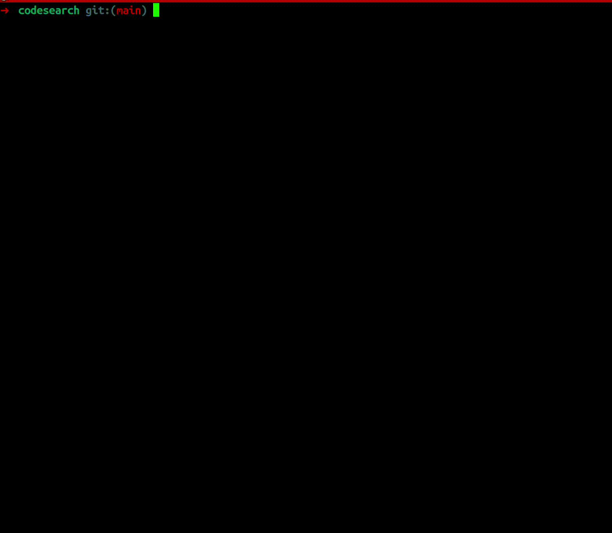

# 🔍 CodeSearch

> Semantic code search for your local code projects using AI embeddings



CodeSearch is CLI tool that enables semantic search across your codebase using natural language queries. It leverages AI embeddings to understand code context and meaning, allowing you to find relevant `code files` even when you don't know the exact keywords.

## ✨ Features

- **🧠 Semantic Search**: Search code using keywords or natural language
- **🚀 Local-First**: Works with local Ollama models for complete privacy
- **☁️ Cloud Support**: Integrates with any LLM provider through LiteLLM
- **📦 SQLite Vectors**: Local vector storage using SQLite & sqlite-vec
- **🔄 Project Management**: Manage multiple projects with different configurations

## 📋 Prerequisites

- [Ollama](https://ollama.ai/) for local embeddings
- [LiteLLM](https://github.com/BerriAI/litellm) proxy for cloud providers

## 🚀 Installation
Download [pre-built binaries](https://github.com/andrejsstepanovs/codesearch/tags)

Install using go

```bash
go install github.com/andrejsstepanovs/codesearch@latest
```

Or build from source:

```bash
git clone https://github.com/andrejsstepanovs/codesearch.git
cd codesearch
go build -o codesearch
```

## 🎯 Quick Start

2. **Build embeddings for your project**:

```bash
# Build with default settings (current directory)
codesearch build myproject . ollama jazzcort/nomic-embed-code-Q6_K:latest

# Or specify a path and extensions
codesearch build myproject /path/to/project ollama jazzcort/nomic-embed-code-Q6_K:latest go,js,ts
```

This will create `myproject.db` database file.

3. **Search your code**:
```bash
codesearch find myproject "function that handles user authentication"
codesearch find myproject "database connection setup"
codesearch find myproject "error handling for API requests"
```

## 📚 Commands

### `build` - Create embeddings for a project

```bash
codesearch build <project-alias> <project-path> [client] [model] [extensions]
```

**Arguments:**
- `project-alias`: Unique identifier for your project
- `project-path`: Path to the project directory (use `.` for current)
- `client`: Either `ollama` or `litellm` (default: `litellm`)
- `model`: Model name (default: `codesearch-embedding`)
- `extensions`: Comma-separated file extensions (default: `go,js,ts,py,java,cpp,c,h,hpp,yaml,yml`)

**Examples:**
```bash
# Local Ollama with Go files only
codesearch build backend ./backend ollama jazzcort/nomic-embed-code-Q6_K:latest go

# LiteLLM with multiple extensions
codesearch build frontend ./frontend litellm codesearch-embedding js,jsx,ts,tsx,css
```

### `sync` - Update embeddings for changed files

```bash
codesearch sync <project-alias>
```

Intelligently updates embeddings by:
- Adding new files
- Updating modified files
- Removing deleted files

**Example:**
```bash
codesearch sync backend
```

### `find` - Search for code

```bash
codesearch find <project-alias> <search-query>
```

**Examples:**
```bash
codesearch find backend "validate email address format"
codesearch find frontend "React component for user profile"
codesearch find backend "SQL query to fetch user permissions"
```

## 🎨 Model Recommendations

### For General Use
**🏆 Best Performance**: `mistral/codestral-embed-2505` via LiteLLM
- Faster response times
- Superior code understanding
- Supports multiple programming languages

### For Local/Offline Use
**🏠 Best Local Model**: `jazzcort/nomic-embed-code-Q6_K:latest` via Ollama
- Good balance of quality and performance
- Runs entirely on your machine
- No API keys required

### LiteLLM Configuration

Tool works only with litellm. Here how to configure it.

```yaml
model_list:
  # Mistral Codestral (Recommended)
  - model_name: codesearch-embedding
    litellm_params:
      model: mistral/codestral-embed-2505
      api_key: os.environ/MISTRAL_API_KEY
```

## 🏗️ Architecture

```
┌─────────────┐     ┌──────────────┐     ┌─────────────┐
│  Code Files │────▶│  Embeddings  │────▶│  SQLite DB  │
└─────────────┘     └──────────────┘     └─────────────┘
                           │                     │
                    ┌──────▼──────┐              │
                    │  LLM Model  │              │
                    └─────────────┘              │
                                                 │
┌─────────────┐     ┌──────────────┐             │
│ Search Query│────▶│  Embedding   │─────────────┤
└─────────────┘     └──────────────┘             │
                                                 ▼
                                    ┌────────────────────┐
                                    │ Vector Similarity  │
                                    │     Search         │
                                    └────────────────────┘
```

## 🙏 Acknowledgments

- [sqlite-vec](https://github.com/asg017/sqlite-vec) for vector search capabilities
- [Ollama](https://ollama.ai/) for local LLM support
- [LiteLLM](https://github.com/BerriAI/litellm) for unified LLM API access
- [fast-shot](https://github.com/opus-domini/fast-shot) for HTTP client functionality

---

Made with ❤️ by developers, for developers. Planning to build MCP with this or integrate in other projects of mine.
